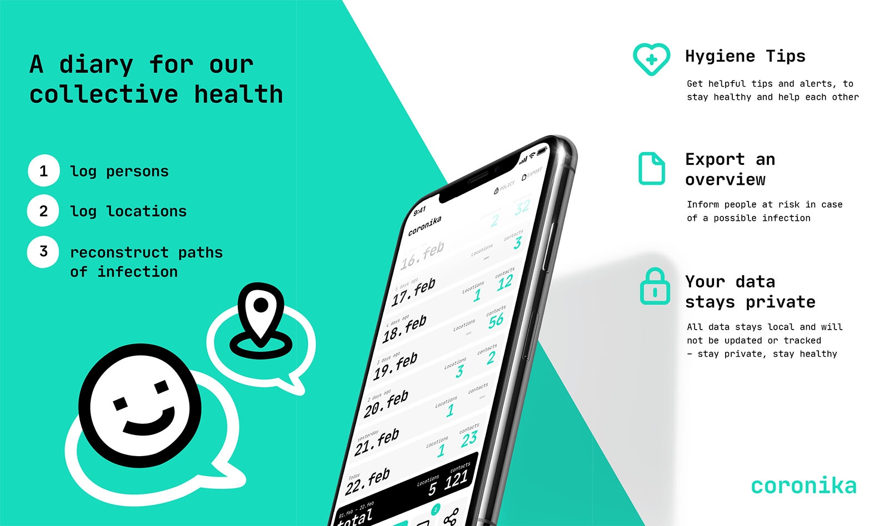

<h1 align="center" style="text-align: center">
    
     
</h1>

  <strong>Coronika is a kind of diary for the health of all.</strong>

  
  
  
  

  

Coronika helps you remember who you met and where you have been to reduce the spread of the virus.
It is essential for health authorities to understand where infected people have been in order to identify sources of infection and contact people.
A small daily contribution from you increases the likelihood that you and your loved ones will remain healthy.  Record where you have been and add people you have met to help contain the virus.

Some reasons why Coronika is good for you:
- Importing contacts: Record which of your contacts you have met or create people manually.
- Save locations: Are you taking the train or are you at the supermarket? Save time and place easily
by click.
- Your data belongs to you: Your entries remain stored locally on your device.
- Hygiene tips and hand washing reminders: Reduce the risk of contracting the virus

If we all make a small contribution, it will have a big effect on health and the spread of the virus.

Get more information on the [website](https://www.coronika.app/) of the app.

## Download the app
The app is available at the Apple App Store and on Google Play:
<table>
<tr>
<td style="border: 0; padding-bottom: 0; padding-left: 0; padding-top: 8px;">

</td>
<td style="border: 0; padding-bottom: 0; padding-left: 0;">

</td>
</tr>
<tr>
<td style="border: 0; padding-left: 0; padding-top: 0;">
<small><em>Apple and the Apple Logo are trademarks of Apple Inc.</em></small>
</td>
<td style="border: 0; padding-left: 15px; padding-top: 0;">
<small><em>Google Play and the Google Play logo are trademarks of Google LLC.</em></small>
</td>
</tr>
</table>

## Translations
The app currently is available in 17 languages:
- 🇦🇪 Arabic
- 🇩🇪 German
- 🇬🇷 Greek
- 🇬🇧 English
- 🇪🇸 Spanish
- 🇫🇮 Finnish
- 🇫🇷 French
- 🇮🇹 Italian
- 🇯🇵 Japanese
- 🇳🇱 Dutch
- 🇵🇱 Polish
- 🇷🇴 Romanian
- 🇷🇺 Russian
- 🇱🇰 Sinhalese
- 🇹🇷 Turkish
- 🇺🇦 Ukrainian
- 🇨🇳 Chinese

## Data protection
You can find information regarding data protection in the [`docs/DATA_PROTECTION.md`](https://github.com/kreativzirkel/coronika/tree/master/docs/DATA_PROTECTION.md) file.
 
This information is also available inside the app and in the data protection policy of our [website](https://www.coronika.app/datenschutz#app).

## Development
The app is built with React Native. This allows us to make the app cross-platform (Android & iOS) available easily.
 
Read [`docs/DEVELOPMENT.md`](https://github.com/kreativzirkel/coronika/tree/master/docs/DEVELOPMENT.md) for more information about development.

---

Licensed **MIT**. Made with ❤️ by [Kreativzirkel](https://www.kreativzirkel.de/).
